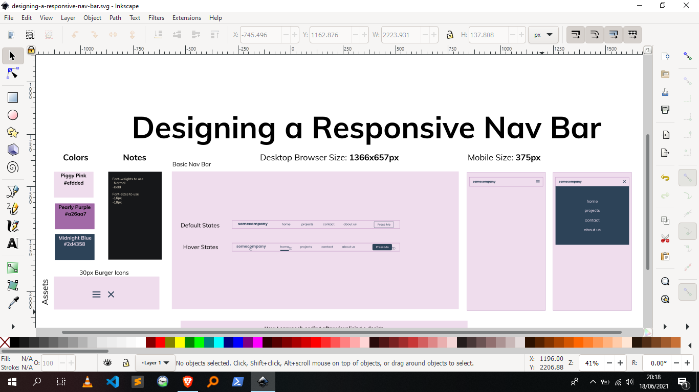
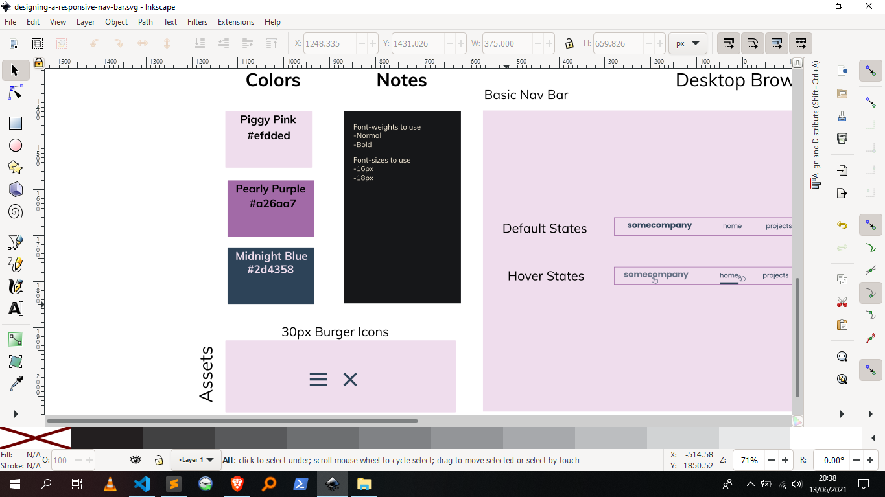
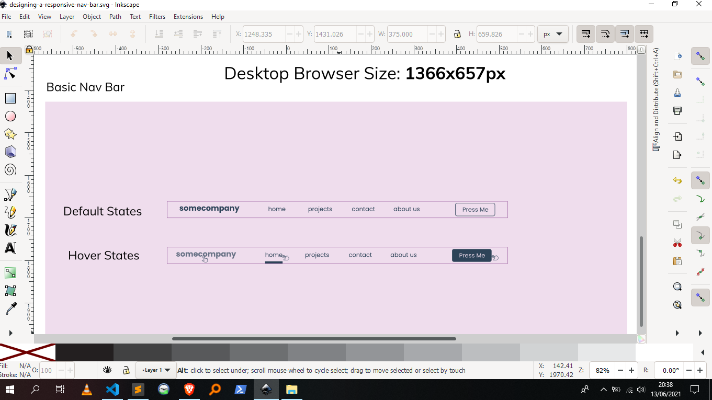
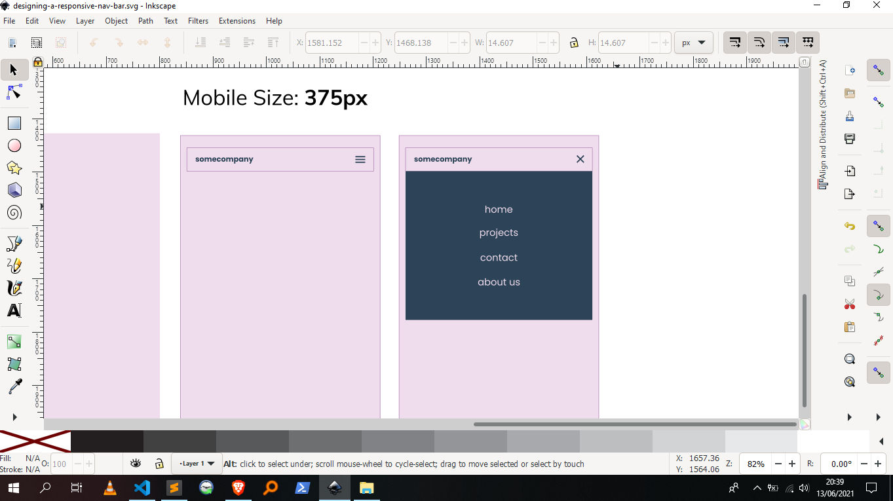
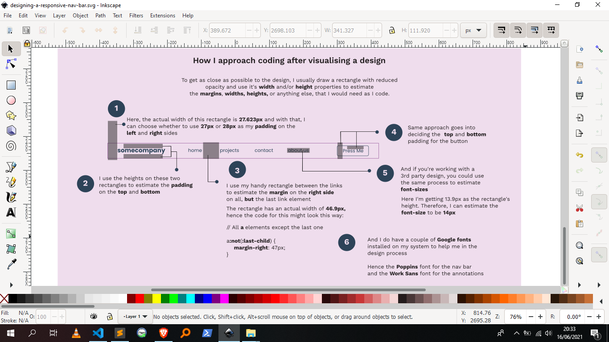
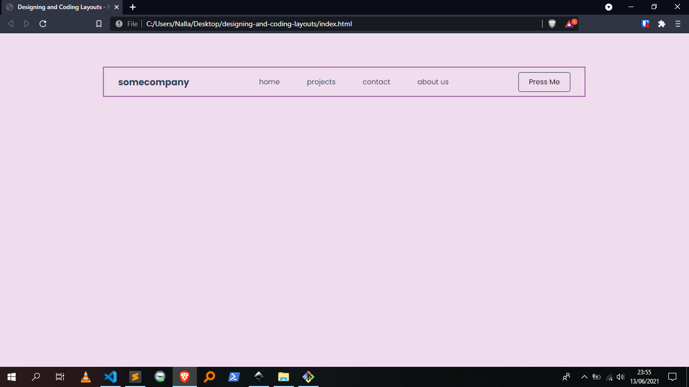
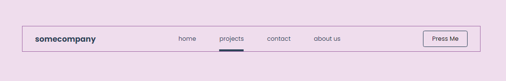
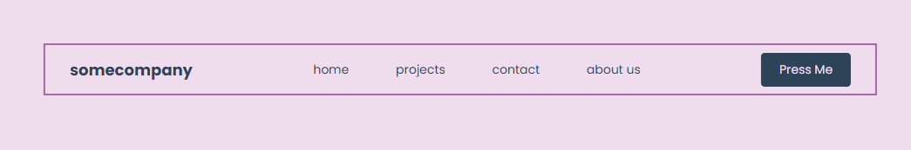
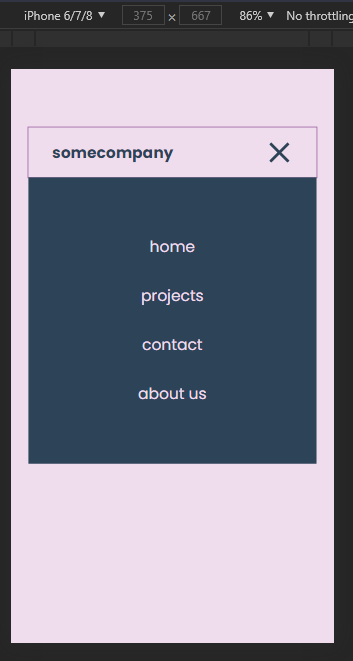

# Designing and Coding Layouts

A breakdown of how I approach coding _my own_ or _3rd party_ designs.

## Table of contents

-  [Overview](#overview)
   -  [The approach](#the-approach)
   -  [Screenshots](#screenshots)
-  [My process](#my-process)
   -  [Built with](#built-with)
   -  [Useful resources](#useful-resources)
-  [Author](#author)

## Overview

### The approach

Where to start:

-  Use a design tool such as [Figma](https://www.figma.com/), [Adobe XD](https://www.adobe.com/products/xd.html) or [Inkscape](https://inkscape.org/) to start desiging your layouts. I love to use the latter. I find it really easy to use and it's FREE.

### Screenshots

Screenshot 1 - A general overview of the design. (_Clicking on this image will give you a better view of the design_)

What's in view:

-  At the far left, there's a _Colors_ and _Notes_ section. I use this section to denote the colors, assets and anything else I will use while coding the actual design.
   -  The _Colors_ section contains the _hex codes_ for the colors used throughout the design.
   -  The _Notes_ section contains key information to remember when coding the design.
-  At the bottom left, there's an _Assets_ section.
   -  It contains icons for the menu burger in both _active_ and _inactive_ states.
-  The middle section of the design contains the actual design of the _Navigation Bar_.
-  The last section, the far right, contains designs for the _Navigation Bar_ on mobile.
   -  It shows the _active_ and _inactive_ states of the menu.

Screenshot 2 - A closer look at the left section of the design. (_Clicking on this image will give you a better view of the design_)

What's in view:

-  In the _Notes_ section, I've denoted the _font-weights_ and _font-sizes_ that will be used while coding the _Navigation Bar_.

Screenshot 3 - A closer look at the mid-section of the design featuring the _Navigation Bar_. (_Clicking on this image will give you a better view of the design_)

What's in view:

-  I drew a rectangle to mimic the _browser size_ on _desktop_. Here, I'm using _1366px by 657px_ as the rectangle's _width_ and _height_.
-  Here, there are two states defined for the _Navigation Bar_:
   -  A _default state_ showing how the _Navigation Bar_ will look by default.
   -  A _hover state_ showing how the _Navigation Bar_ will look on hover. We can see that the _logo_ will have a reduced opacity, the _links_ will have a bar below them, and the _button_ will have a different colored background and text.

Screenshot 4 - A closer look at the _Navigation Bar_ on mobile. (_Clicking on this image will give you a better view of the design_)

What's in view:

-  A _menu closed_ state.
-  A _menu open_ state showing:
   -  how the _links_ will be positioned
   -  the _background size_ and _color_ for the _links_

Screenshot 5 - Annotations for the _Navigation Bar_. (_Clicking on this image will give you a better view of the design_)

What's in view:

-  Explanations on how I bring the design to life with code.

Screenshot 6 - A look at the coded design for desktops. (_Clicking on this image will give you a better view of the design_)

What's in view:

-  The _Navigation Bar_ in-browser.

Screenshot 7 - A look at the hover state on a link. (_Clicking on this image will give you a better view of the design_)

Screenshot 8 - A look at the hover state on the button. (_Clicking on this image will give you a better view of the design_)

Screenshot 9 - A look at the coded design for mobile. (_Clicking on this image will give you a better view of the design_)

What's in view:

-  Clicking on the _burger_ will toggle the _menu_ containing the site's _links_.

## My process

### Built with

-  Semantic HTML5 markup
-  Flexbox
-  Desktop-first workflow
-  [Inkscape](https://inkscape.org)

### Useful resources

-  [Inkscape](https://inkscape.org) - Inkscape SVG Editor. I use it all the time when I'm working on any web project. After designing this project, I used _Inkscape's_ in-built tools to figure out the _spacing_, _sizing_ and _positioning_ of elements throughout the project.

## Author

-  Github - [@AllanKirui](https://www.github.com/AllanKirui)
-  Instagram - [@nallawilljr](https://www.instagram.com/nallawilljr)
