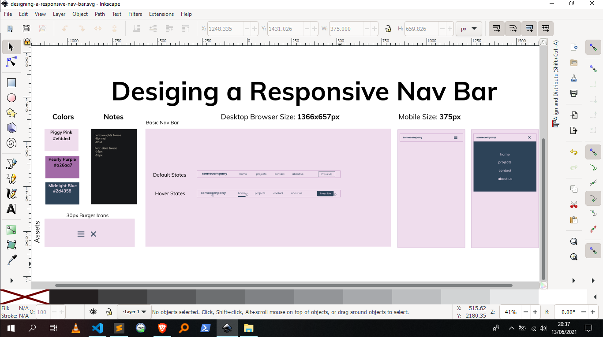
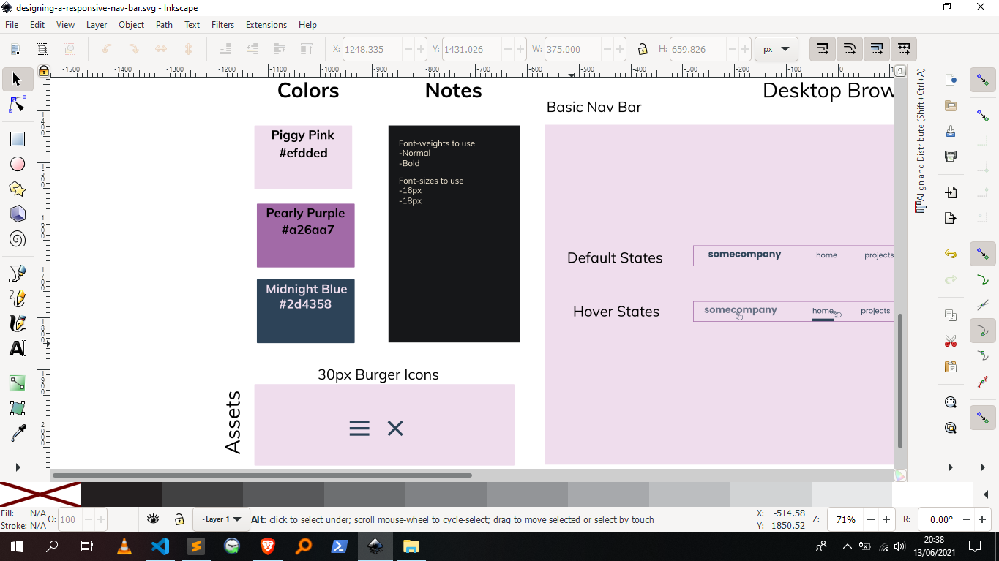
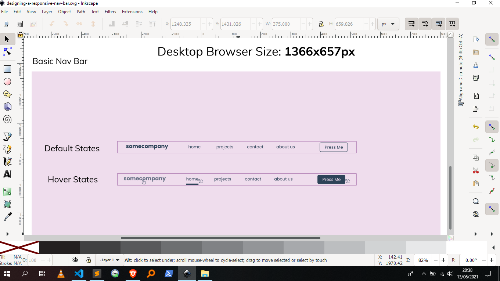
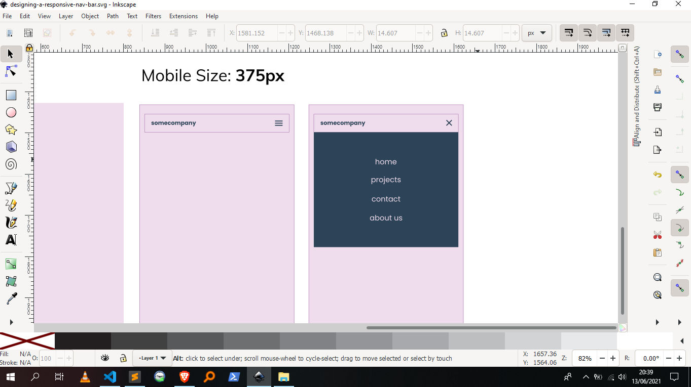
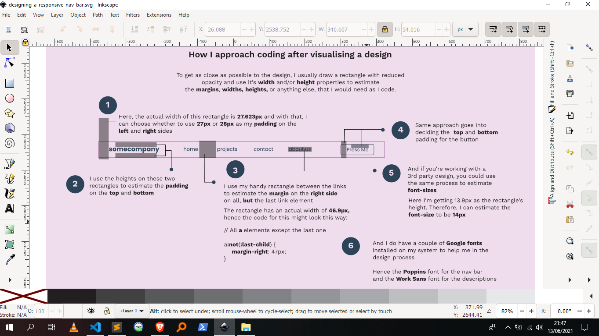
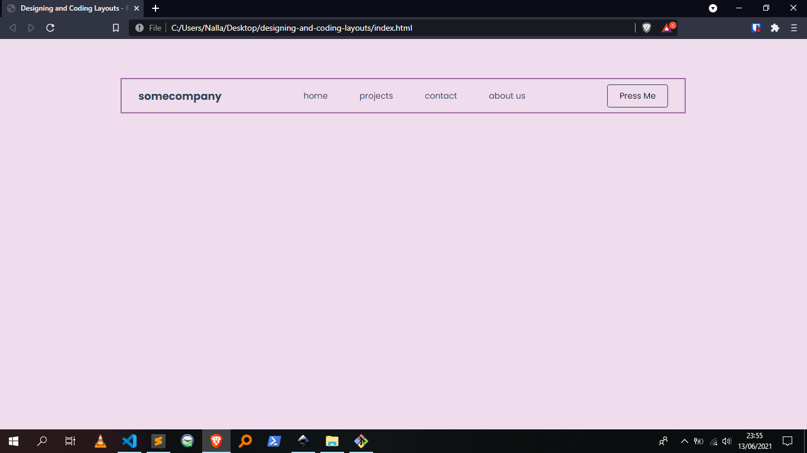
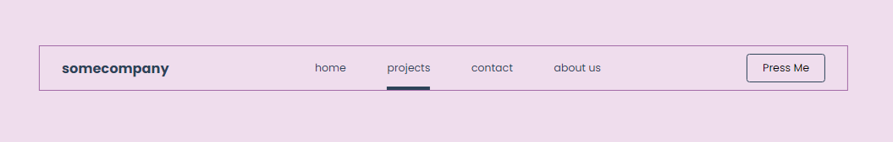
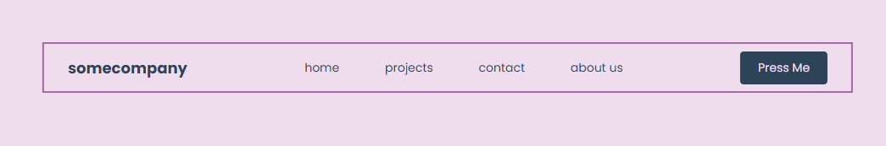
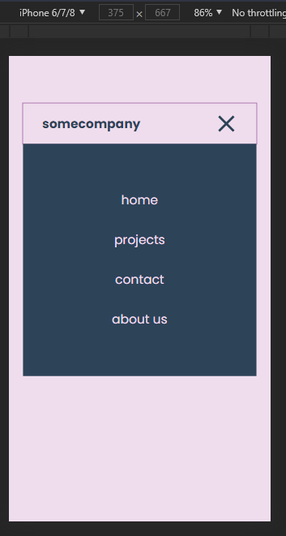

# Designing and Coding Layouts

A breakdown of how I approach coding *my own* or *3rd party* designs.

## Table of contents

-  [Overview](#overview)
   -  [The approach](#the-approach)
   -  [Screenshots](#screenshots)
-  [My process](#my-process)
   -  [Built with](#built-with)
   -  [Useful resources](#useful-resources)
-  [Author](#author)

## Overview

### The approach

Where to start:

-  Use a design tool such as [Figma](https://www.figma.com/), [Adobe XD](https://www.adobe.com/products/xd.html) or [Inkscape](https://inkscape.org/) to start desiging your layouts. I love to use the latter. I find it really easy to use and it's FREE.

### Screenshots

Screenshot 1 - A general overview of the design. (*Clicking on this image will give you a better view of the design*) 

What's in view:
- At the far left, there's a *Colors* and *Notes* section. I use this section to denote the colors, assets and anything else I will use while coding the actual design.
  - The *Colors* section contains the *hex codes* for the colors used throughout the design.
  - The *Notes* section contains key information to remember when coding the design.
- At the bottom left, there's an *Assets* section.
  - It contains icons for the menu burger in both *active* and  *inactive* states.
- The middle section of the design contains the actual design of the *Navigation Bar*.
- The last section, the far right, contains designs for the *Navigation Bar* on mobile.
  - It shows the *active* and *inactive* states of the menu.

Screenshot 2 - A closer look at the left section of the design. (*Clicking on this image will give you a better view of the design*) 

What's in view:
- In the *Notes* section, I've denoted the *font-weights* and *font-sizes* that will be used in coding the *Navigation Bar*.

Screenshot 3 - A closer look at the mid-section of the design featuring the *Navigation Bar*. (*Clicking on this image will give you a better view of the design*) 

What's in view:
- I drew a rectangle to mimic the *browser size* on *desktop*. Here, I'm using *1366px by 657px* as the rectangle's *width* and *height*.
- Here, there are two states defined for the *Navigation Bar*:
  - A *default state* showing how the *Navigation Bar* will look by default.
  - A *hover state* showing how the *Navigation Bar* will look on hover. We can see that the *logo* will have a reduced opacity, the *links* will have a bar below them, and the *button* will have a different colored background and text.

Screenshot 4 - A closer look at the *Navigation Bar* on mobile. (*Clicking on this image will give you a better view of the design*) 

What's in view:
- A *menu closed* state.
- A *menu open* state showing: 
  - how the *links* will be positioned
  - the *background size* and *color* for the *links* 

Screenshot 5 - Annotations for the *Navigation Bar*. (*Clicking on this image will give you a better view of the design*) 

What's in view:
- Explanations on how I bring the design to life with code.

Screenshot 6 - A final look at the coded design for desktops. (*Clicking on this image will give you a better view of the design*) 

What's in view:
- The *Navigation Bar* in-browser.

Screenshot 7 - A look at the hover state on a link. (*Clicking on this image will give you a better view of the design*) 

Screenshot 8 - A look at the hover state on the button. (*Clicking on this image will give you a better view of the design*) 

Screenshot 9 - A final look at the coded design for mobile. (*Clicking on this image will give you a better view of the design*) 

What's in view:
- Clicking on the *burger* will toggle the *menu* containing the site's *links*.

## My process

### Built with

-  Semantic HTML5 markup
-  Flexbox
-  Desktop-first workflow
-  [Inkscape](https://inkscape.org) - Inkscape: Open Source Scalable Vector Graphics Editor

### Useful resources

-  [Inkscape](https://inkscape.org) - Inkscape SVG Editor. I use it all the time when I'm working on any web project. After designing this project, I used *Inkscape's* in-built tools to figure out the _spacing_, _sizing_ and _positioning_ of elements throughout the project.

## Author

-  Github - [@AllanKirui](https://www.github.com/AllanKirui)
-  Instagram - [@nallawilljr](https://www.instagram.com/nallawilljr)
